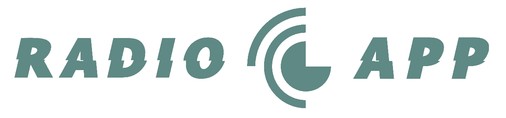

<a name="top"></a>


<!-- PROJECT LOGO -->
<br />
<div align="center">
  <a href="https://github.com/yagoquesada/radio_app">
    
  </a>

<h3 align="center">Radio App</h3>

  <p align="center">
    Discover a world of audio with our Flutter Radio App. Stream live radio, to listen to songs and podcasts. Elegant, cross-platform, and user-friendly. Elevate your audio experience with this Radio App.
    <br />
    <a href="https://github.com/yagoquesada/radio_app"><strong>Explore the docs »</strong></a>
    <br />
    <br />
    <a href="https://github.com/yagoquesada/radio_app">View Demo</a>
    ·
    <a href="https://github.com/yagoquesada/radio_app/issues">Report Bug</a>
    ·
    <a href="https://github.com/yagoquesada/radio_app/issues">Request Feature</a>
  </p>
</div>


<!-- TABLE OF CONTENTS -->
<details>
  <summary>Table of Contents</summary>
  <ol>
    <li>
      <a href="#-about-the-project">About The Project</a>
      <ul>
        <li><a href="#%EF%B8%8F-built-with">Built With</a></li>
        <li><a href="#-screenshots">Screenshots</a></li>
      </ul>
    </li>
    <li>
      <a href="#-getting-started">Getting Started</a>
      <ul>
        <li><a href="#prerequisites">Prerequisites</a></li>
        <li><a href="#installation">Installation</a></li>
      </ul>
    </li>
    <li><a href="#-usage">Usage</a></li>
    <li><a href="#%EF%B8%8F-features">Features</a></li>
    <li><a href="#-contributing">Contributing</a></li>
    <li><a href="#%EF%B8%8F-contact">Contact</a></li>
  </ol>
</details>


## 📻 About The Project

### 🛠️ Built With

* [![Flutter][Flutter-img]][Flutter-url]
* [![Dart][Dart-img]][Dart-url]

### 📸 Screenshots

<p align="right">(<a href="#top">back to top</a>)</p>

## ✅ Getting Started 

To get a local copy up and running follow these simple example steps.

### Prerequisites

Software that users need to have installed before they can use your project.

- Flutter: [Installation Guide](https://flutter.dev/docs/get-started/install)

### Installation

1. Clone the repository:
   ```bash
   git clone https://github.com/yagoquesada/brainy.git
2. Change to the project directory
   ```bash
   cd your-project
3. Install dependencies
   ```bash
   flutter pub get
   ```

<p align="right">(<a href="#top">back to top</a>)</p>
   
## 🙌 Usage

First of all go to apiKey inside [constants.dart](https://github.com/yagoquesada/radio_app/blob/main/lib/core/constants/constants.dart) and change YOUR_API_KEY for your key. 

You can get a key creating an account at [Rapid API](https://rapidapi.com/auth/sign-up?referral=/hub), then subscribing to the Radio World Api [here](https://rapidapi.com/dpthapaliya19/api/radio-world-75-000-worldwide-fm-radio-stations).

> [!NOTE]
> There are differents subscription, to try you can use the free plan, but if you are planning to use the API frequently, you'll need a paid plan.

Once you are subscirbed to a plan you can see your API key, next to `X-RapidAPI-Key`

Then you are ready to run it!
  ```bash
  flutter run
  ```

> [!WARNING] 
> The API used has limited requests when using the free plan, so unless you have a paid subscription to the API, you will get an error screen inside the app.

<p align="right">(<a href="#top">back to top</a>)</p>

## ⚙️ Features

### 1. Home Screen with Radio Stations

- **Description:** The app features a home screen displaying a list of radio stations.
- **Functionality:**
  - View a list of radio stations.
  - Filter stations by genre.
  - Intuitive user interface for easy navigation.

### 2. Radio Player Screen

- **Description:** Navigate to a detailed screen for each radio station selected from the home screen.
- **Functionality:**
  - Display station details (e.g., name, genre, song name).
  - Controls for playback:
    - Play/Pause: Start or pause the station stream.
    - Volume Control: Adjust the volume of the streaming audio.
    - Previous Station: Navigate to the previous radio station in the list.
    - Next Station: Navigate to the next radio station in the list.
    - Refresh: Reload the current station for an updated stream.

### 3. Responsive User Interface

- **Description:** The app provides a responsive and user-friendly interface.
- **Functionality:**
  - Ensures a seamless user experience across different devices and screen sizes.

### 4. Genre Filtering

- **Description:** Enhance user experience by allowing the filtering of radio stations based on genres.
- **Functionality:**
  - Easily switch between different genres to discover stations of interest.

### 5. Stream Handling

- **Description:** Efficient handling of radio stream playback.
- **Functionality:**
  - Seamless transition between stations.
  - Robust error handling and user feedback for stream-related issues.

### 6. Intuitive Controls

- **Description:** User-friendly controls for managing the radio playback.
- **Functionality:**
  - Easy-to-use play, pause, volume, and navigation controls.

### 7. Station Information

- **Description:** Provide relevant information about the currently playing radio station.
- **Functionality:**
  - Display station name, logo, and additional details.

<p align="right">(<a href="#top">back to top</a>)</p>

## 🤝 Contributing

Contributions are what make the open source community such an amazing place to learn, inspire, and create. Any contributions you make are **greatly appreciated**.

If you have a suggestion that would make this better, please fork the repo and create a pull request. You can also simply open an issue with the tag "enhancement".
Don't forget to give the project a star! Thanks again!

1. Fork the Project
2. Create your Feature Branch (`git checkout -b feature/AmazingFeature`)
3. Commit your Changes (`git commit -m 'Add some AmazingFeature'`)
4. Push to the Branch (`git push origin feature/AmazingFeature`)
5. Open a Pull Request

<p align="right">(<a href="#top">back to top</a>)</p>

## ✉️ Contact

Your Name - [@instagram](https://www.instagram.com/yagoquesada/) - yagoquesada2001@gmail.com

Project Link: [https://github.com/yagoquesada/radio_app](https://github.com/yagoquesada/brainy)

<p align="right">(<a href="#top">back to top</a>)</p>

<!-- MARKDOWN LINKS & IMAGES -->
[Flutter-img]: https://img.shields.io/badge/Flutter-%2302569B.svg?style=for-the-badge&logo=Flutter&logoColor=white
[Flutter-url]: https://flutter.dev/
[Dart-img]: https://img.shields.io/badge/dart-%230175C2.svg?style=for-the-badge&logo=dart&logoColor=white
[Dart-url]: https://dart.dev/

